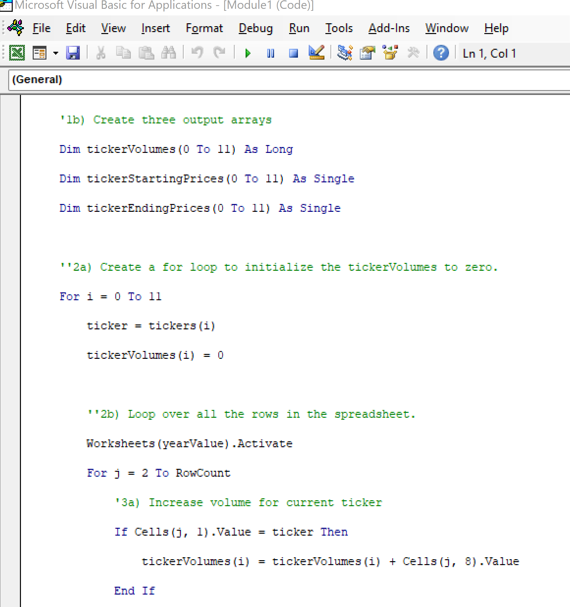
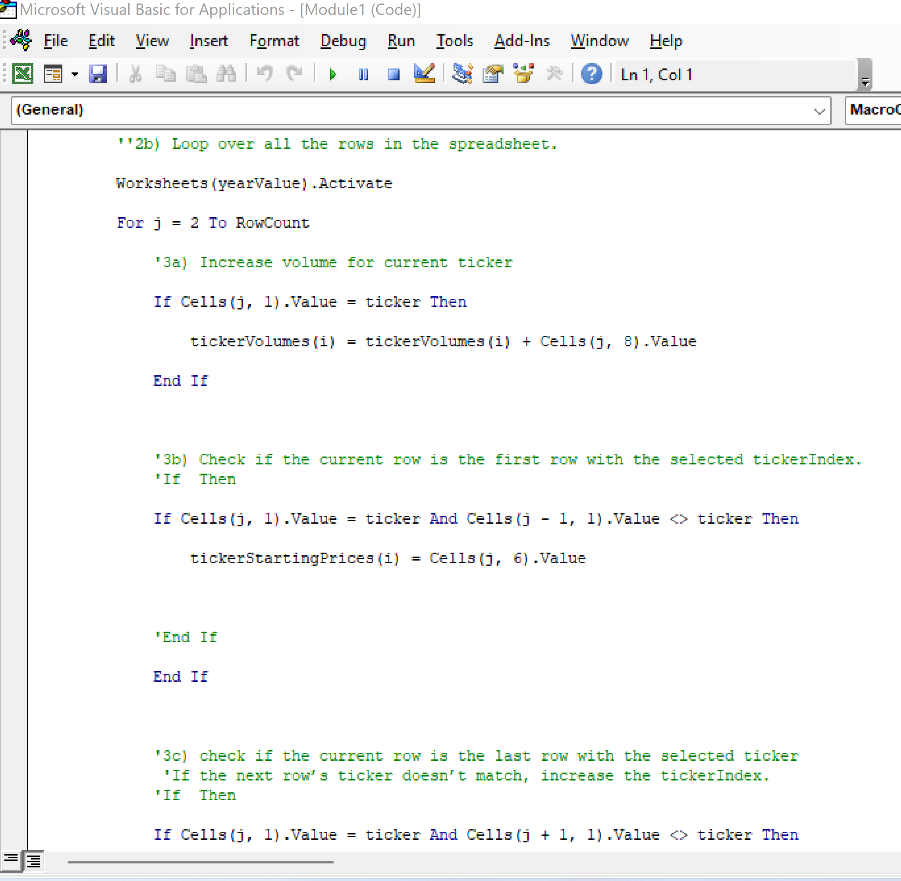
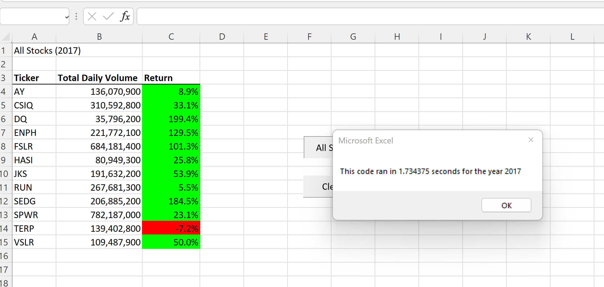
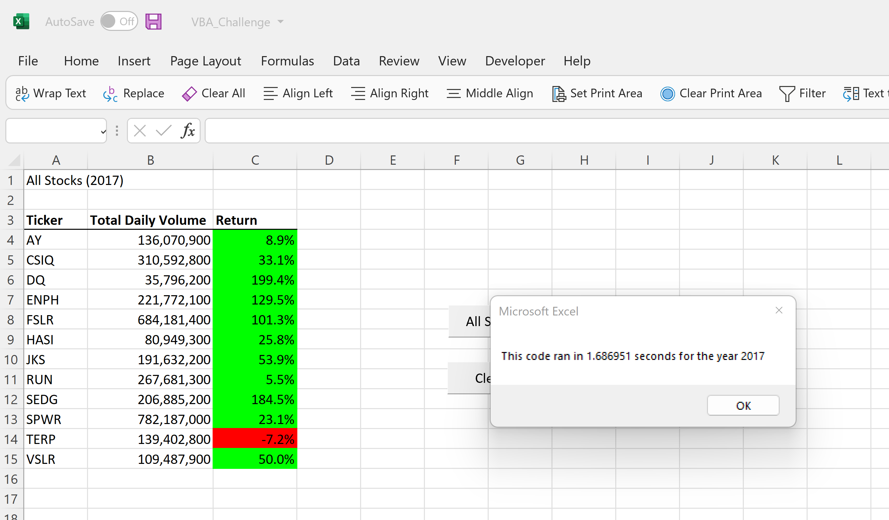
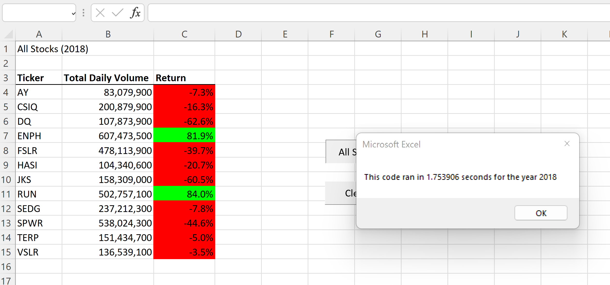
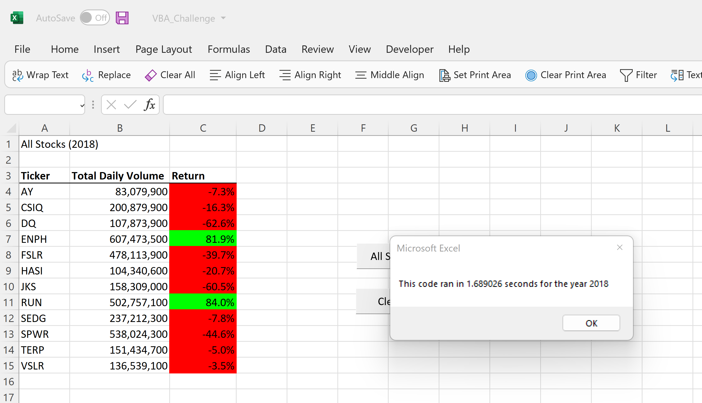

# Stock-Analysis
This repo is used to conduct stock analyses.
# Stock Analysis for Steve

## Overview of Project
---
After learning that DAQO may not be the best investment option for Steve's parents, Steve engaged me to analyze 12 stocks to find a more desireable investing alternative.  In response to Steve's request, I created a macro to quickly expand the initial DAQO analysis.  While that macro was well received, it took much longer to run.  This highlighted a need to refactor the code to reduce its run time.

## Purpose
---
This report intends to convey the work performed to successfully refactor the initial 12 stock analysis provided to Steve.

## Results
---
To refactor the macro, I employed an array approach to decrease the macro run time.  With a few minor updates, this new and improved macro provides Steve the ability to easily scale his stock analysis.  The screen shot below illustrates how I initialized the arrays used in the refactored macro.

After initializing the output arrays, the script employed loops to populate the newly created arrays.  The screen shot below depicts an example of some of the loops used on the arrays.

## Comparing the 2017 Stock Analysis Macros

The refactored code decreased the run time across the 12 stock list by 0.05 seconds using the 2017 stock dataset.  The screen shots below compare the run times between the two macros.

### Initial 2017 Run Time

### Refactored 2017 Run Time

## Comparing the 2018 Run Time

The refactored code decreased the run time across the 12 stock list by 0.07 seconds using the 2018 stock dataset.  The screen shots below compare the run times between the two macros.

### Initial 2018 Run Time

### Refactored 2018 Run Time

## Summary
---
- What are the advantages or disadvantages of refactoring code?

Properly refactored code will allow data users to quickly expand the scope of analysis while minimizing the burden on their computer systems.  In some cases, the refactored code is easier to read and understand.  Refactored code also allows business to perform analyses faster, reducing the overall cost to gain insights into their data.

- How do the aforementioned pros and/or cons apply to refactoring the original VBA script?

As a budding financial analyst, Steve can benefit from all of the previously described advantages of refactored code.  He can easily scale his analysis while performing them faster and cheaper.  This could free up his time to meet with clients or perform more thorough financial analyses.  Afterall, time is our most scarce resource.    
